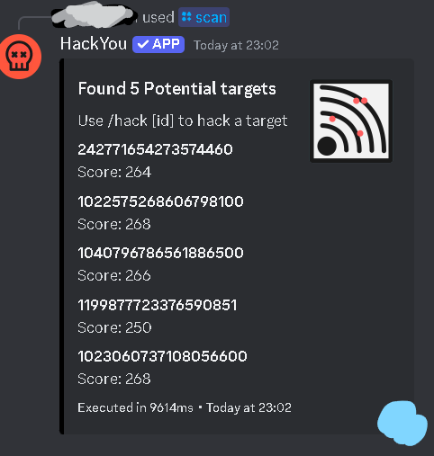
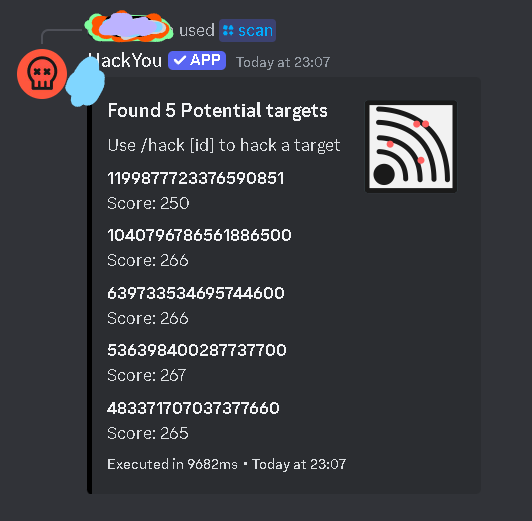

# HACK.io
## <span style="color:pink" font="System" >HACKYOU BOT AUTOMATOR</span>

### - SETUP.py
- Setup.py is an imporant feature  of __hackv1__ , Hackv1 is a little manual , but requires less dependencies !

>-   #### Work of Setup.py
 - It scarapes Out all 18-19 digit numbers from text of  ```/scan```
 - Spam ```/scan``` multiple times and Copy All the Result and Put it in ```text_Scrape.txt``` 
 - It Will put all the scraped text in assets/hacks.txt file


### - HACKv1.py
>   The first Model of Automator

- After Setting up All the ids /code in Hacks.txt , It will read the code and execute ```/hack {id}```

 ####  Auto Upgrade feature
If you gain alot of BTC , then others will simply take it from you if you leave it like that all along, To prevent it There is a must need of upgrade 

- do a __*```/exploit```*__ or __*```/virus```*__ , then press __Shift__ , It will simply Record the Mouse Position , and randomly upgrade your exploits , firewall and Virus


>[!NOTE] 
>    __It is seen as after some time , the hackv1 continues working but the HackYou Bot Breaks (you will see Negative Time Errors) . This happens due to late use of Codes and old codes__

## HACKv2.py

 ### The Ultimate Solution
   > #### SETUP
 - Do a __```/scan```__ and record the position 
    - #### <font color='lightcyan'>First : Bottom Right</font> 
    - 
    -  __Place The mouse Cursor Here ,and Press SHIFT__
    - IT SHOULD BE DONE SIMULTANEOUSLY AFTER a ```/SCAN```
    
    - ### <font color='lightgreen'>First : TOP LEFT</font> 
    - __Place The mouse Cursor Here (blue region) ,and Press SHIFT__
    - 
- SIT BACK , ENJOY

-  NO upgrade feature in V2 (make your Firewall  Stronger!) {UPDATE : NOW IT DOES }

## <font color='lightYellow'>DEPENDENCIES</font>
### - HACKv1
 - time  ==> ```pip install time```

 - pynput ==> ```pip install pynput```

 - pyautogui ==> ```pip install pyautogui```

 - random ==> ```pip install random```

### - HACKv2
 #### INSTALL ALL THAT IS MENTIONED IN HACKv1
 - PyTesseract ==> ```pip install pytesseract```

 - Download Tesseract From Here : [Tesseract Github](https://github.com/tesseract-ocr/tesseract/releases/download/5.5.0/tesseract-ocr-w64-setup-5.5.0.20241111.exe)

 - __Install it in ```C:\Program Files\Tesseract-OCR\tesseract.exe```__ (DEFAULT !) or Else you have to change the location in HACKV2.py


> [!NOTE]
> You can't Use your PC simultaneously When It happens , Leave It for automation 

> [!WARNING]
>  I am not Responsible for your ban (Not likely to Happen).

# <font color='lightblue'>ENJOY !</font>
